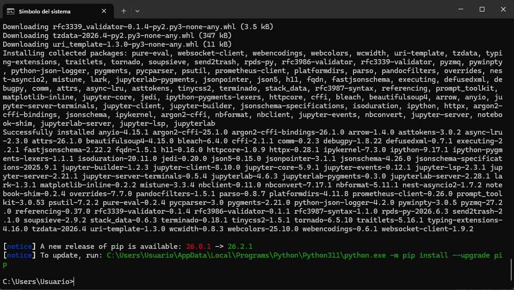
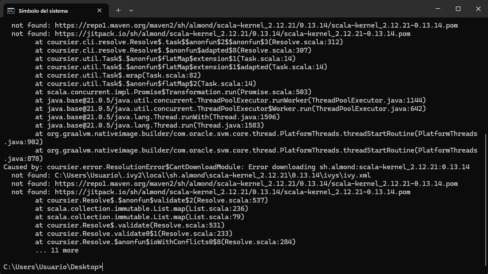
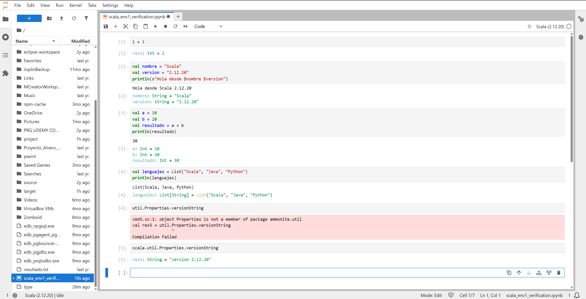

# Entorno 1 — JupyterLab + Almond Kernel + Scala

## Objetivo

Preparar un entorno interactivo basado en JupyterLab que permita ejecutar código Scala mediante el kernel Almond, y comprobar que las tres pruebas básicas de código se ejecutan correctamente.

## 1. Instalación de los requisitos

Para este entorno instalé:

- **Python** (ya lo tenía instalado en el sistema), necesario para poder instalar y ejecutar JupyterLab.
- **JupyterLab**, instalado mediante `pip`.
- **JDK 17** (Eclipse Adoptium Temurin), necesario porque Almond ejecuta Scala sobre la JVM.
- **Coursier**, la herramienta que se usa para descargar e instalar el propio kernel de Almond.

Comprobé la instalación de Java desde una terminal:

```bash
java -version
javac -version
```


*Aquí se muestra el resultado de `java -version` y `javac -version`, confirmando que el JDK 17 de Eclipse Adoptium está correctamente instalado y accesible desde la terminal.*

## 2. Instalación de JupyterLab

Instalé JupyterLab con pip y comprobé que arrancaba correctamente ejecutando:

```bash
jupyter lab
```

Esto abre JupyterLab en el navegador por defecto, accediendo a través de `http://localhost:8888/lab`.



*Captura de JupyterLab ya iniciado y accesible desde el navegador, antes de instalar el kernel de Scala.*

## 3. Instalación de Almond Kernel

Instalé Almond como kernel de Scala para Jupyter usando Coursier. El proceso registra un archivo `kernel.json` en la carpeta de kernels de usuario de Jupyter (`AppData\Roaming\jupyter\kernels\scala` en Windows).

Durante la instalación tuve que resolver varios problemas:

- El `kernel.json` generado tenía las rutas de Windows mal escapadas (barras invertidas sueltas), lo que provocaba un error de JSON inválido y que el kernel ni siquiera apareciera listado.
- La versión de Scala solicitada por el enunciado (2.12.21) no tiene ningún kernel de Almond publicado en Maven Central; la versión más reciente disponible es la **2.12.20**, así que usé esa.
- Coursier tenía cacheada una referencia rota a una instalación antigua de JDK 21 que ya no existía en el disco. Lo solucioné fijando la variable de entorno `JAVA_HOME` al JDK 17 correcto.
- Al `kernel.json` le faltaba el flag `--connection-file` antes de la ruta del archivo de conexión, lo que impedía que Almond arrancara correctamente como kernel.

Una vez corregido, comprobé que el kernel aparecía listado:

```bash
jupyter kernelspec list
```



*Salida de `jupyter kernelspec list` mostrando el kernel "scala" ya registrado y sin errores de carga, junto con el selector de kernel de JupyterLab donde aparece la opción "Scala (2.12.20)".*

## 4. Verificación de la versión de Scala

Creé un nuevo notebook seleccionando el kernel de Scala y ejecuté:

```scala
scala.util.Properties.versionString
```

(Uso `scala.util.Properties` en vez de `util.Properties` porque Almond define su propio paquete `ammonite.util`, que entra en conflicto con `scala.util` si no se especifica la ruta completa.)


*El resultado muestra "version 2.12.20", confirmando que el notebook está usando la versión de Scala esperada.*

## 5. Ejecución de código Scala

### Prueba 1 — Saludo con interpolación de strings

```scala
val nombre = "Scala"
val version = "2.12.20"
println(s"Hola desde $nombre $version")
```



*La celda imprime correctamente "Hola desde Scala 2.12.20", confirmando que la interpolación de strings funciona en el kernel.*

### Prueba 2 — Operación numérica

```scala
val a = 10
val b = 20
val resultado = a + b
println(resultado)
```


*La celda imprime "30", el resultado esperado de la suma.*

### Prueba 3 — Colección

```scala
val lenguajes = List("Scala", "Java", "Python")
println(lenguajes)
```


*La celda imprime `List(Scala, Java, Python)`, confirmando que las colecciones de Scala funcionan correctamente en el notebook.*

## 6. Notas y decisiones tomadas

- **Cambio de versión de Scala**: el enunciado pedía Scala 2.12.21, pero Almond no tiene publicado ningún kernel compilado para esa versión exacta en Maven Central. Usé la versión 2.12.20, que es la más reciente con soporte de Almond disponible en el momento de realizar la práctica.
- El notebook final se guardó como `entorno-scala.ipynb` dentro de `parte1/notebook/`.

## Evidencias incluidas

- [x] JupyterLab ejecutándose
- [x] Almond disponible como kernel
- [x] Notebook utilizando Scala
- [x] Versión de Scala utilizada
- [x] Ejecución correcta de las tres pruebas
