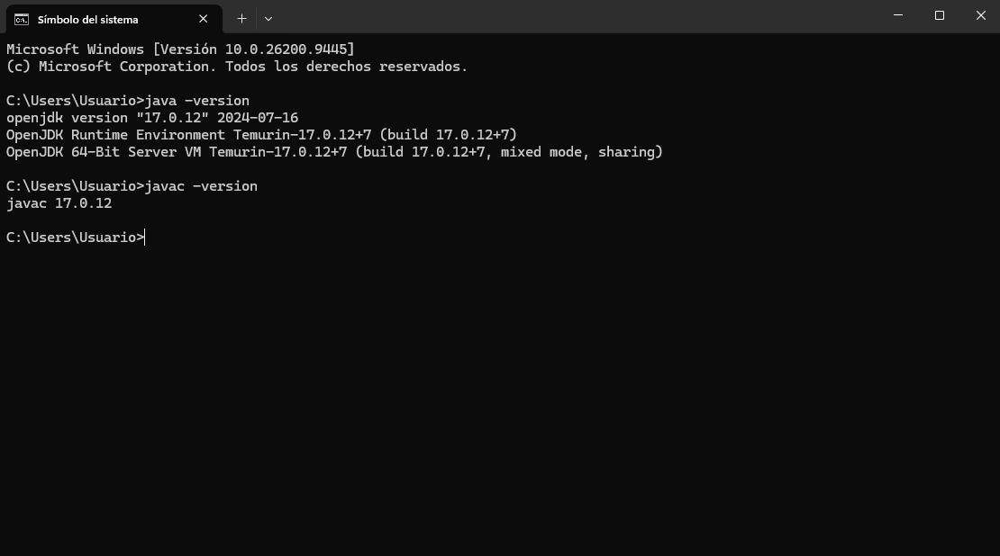
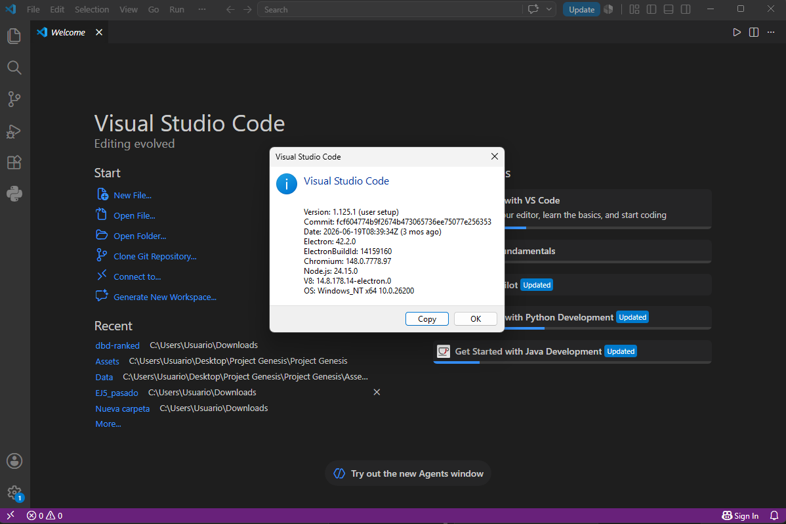
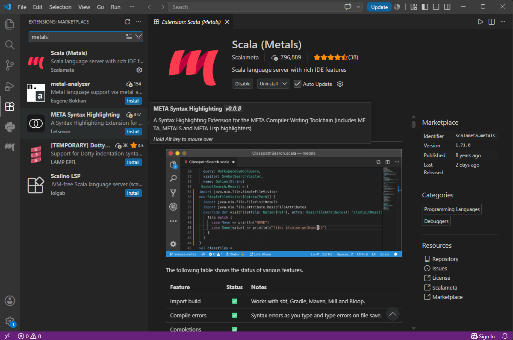
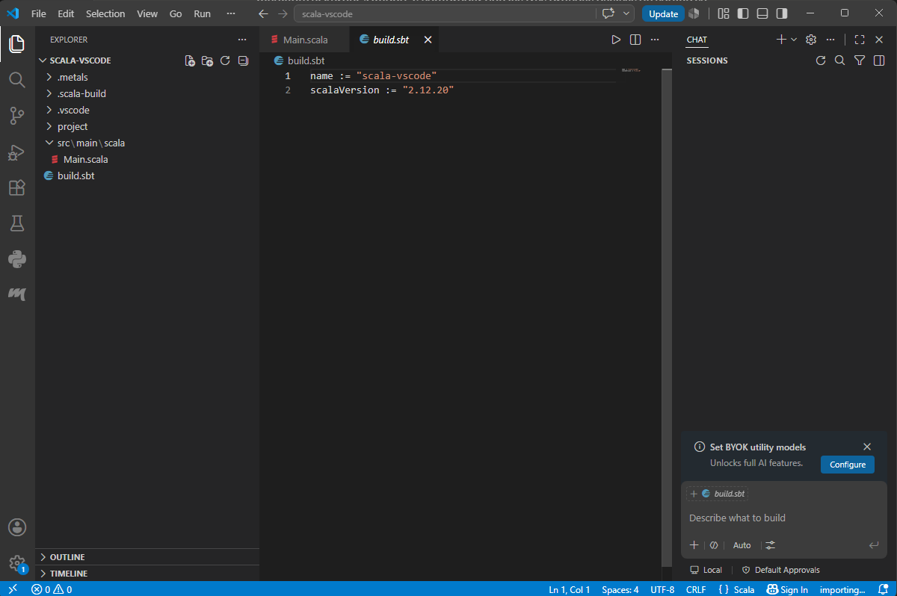
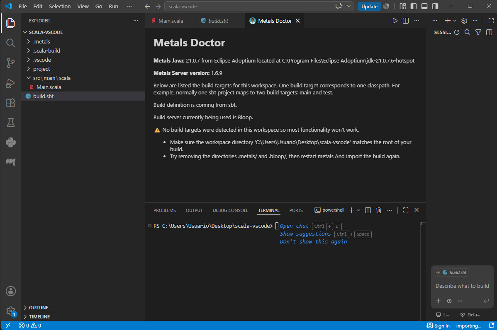
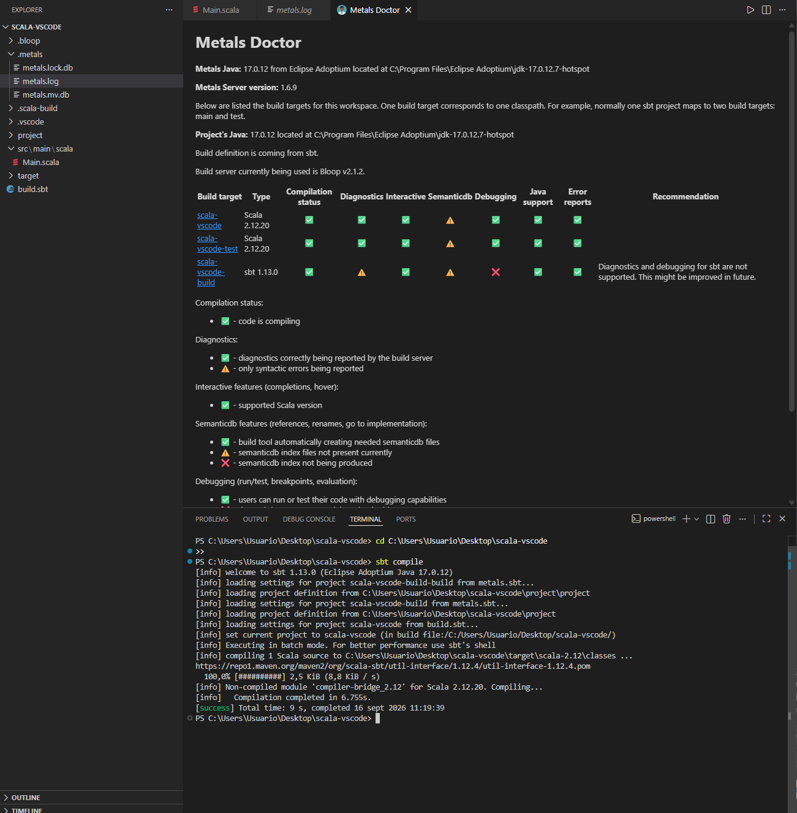
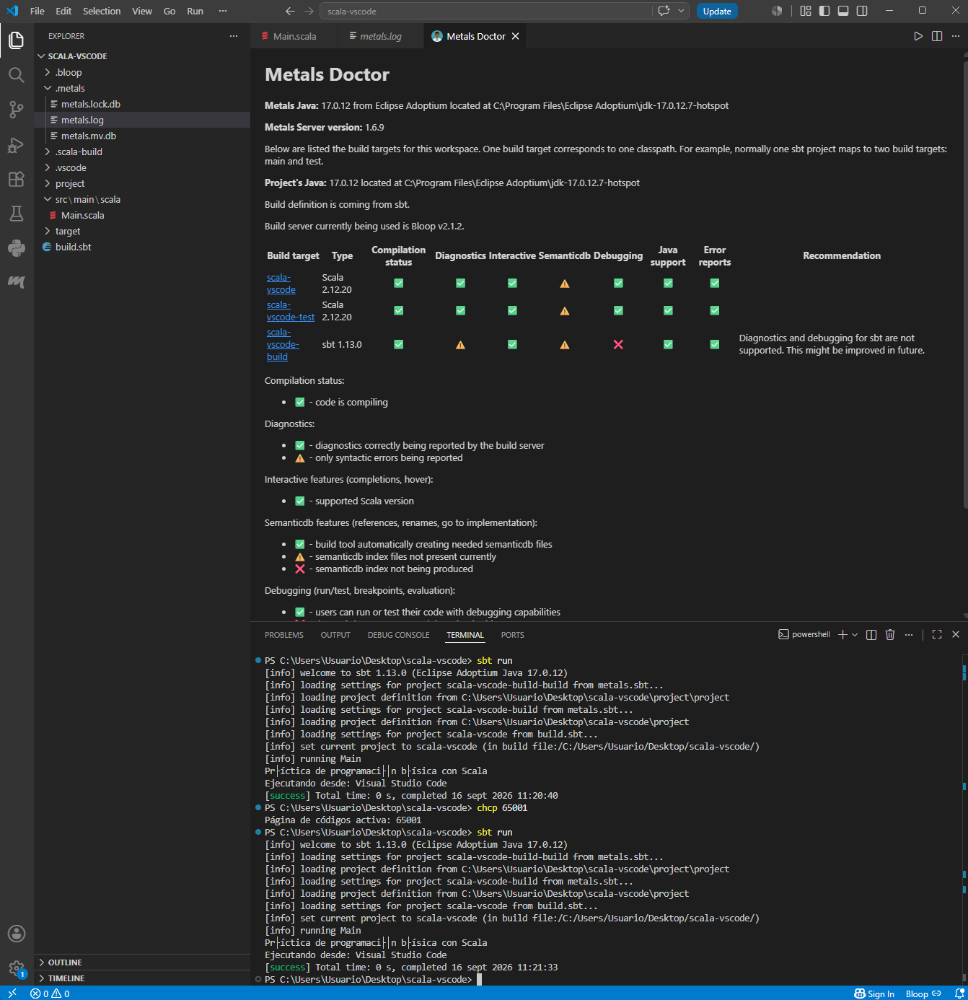

# Entorno 2 — Visual Studio Code + Metals + Scala 2.12.20 + JDK 17 + sbt

## Objetivo

Preparar un entorno de desarrollo para proyectos Scala estructurados en varios archivos, usando Visual Studio Code con la extensión Metals y sbt como herramienta de construcción.

## 1. Visual Studio Code

Ya tenía Visual Studio Code instalado previamente en el sistema. Comprobé la versión desde `Ayuda → Acerca de`.



*Pantalla "Acerca de" de Visual Studio Code, mostrando la versión instalada.*

## 2. Instalación de la extensión Metals

Desde el panel de extensiones (`Ctrl+Shift+X`) busqué "Scala (Metals)", la extensión oficial publicada por Scalameta, y la instalé.



*Panel de extensiones de VS Code mostrando "Scala (Metals)" instalada.*

## 3. Comprobación de sbt

Comprobé que sbt ya estaba instalado en el sistema ejecutando desde una terminal:

```bash
sbt --version
```



*Salida del comando confirmando sbt 1.10.7 instalado y funcionando.*

## 4. Creación del proyecto

Creé la carpeta del proyecto y su estructura desde la terminal integrada de VS Code:

```powershell
mkdir scala-vscode
cd scala-vscode
mkdir project
mkdir src\main\scala
```

## 5. Configuración de build.sbt

Creé el archivo `build.sbt` en la raíz del proyecto con el siguiente contenido:

```scala
name := "scala-vscode"
scalaVersion := "2.12.20"
```

**Nota sobre la versión de Scala**: el enunciado pedía Scala 2.12.21, pero esa versión no tiene ningún kernel/compilador con soporte completo disponible en el ecosistema de herramientas usado en esta práctica (el mismo problema que se documentó en el Entorno 1 con Almond). Para mantener consistencia entre los tres entornos, usé Scala **2.12.20** en los tres.



*Contenido de build.sbt junto con la estructura de carpetas del proyecto (`project/`, `src/main/scala/Main.scala`) visible en el explorador de archivos de VS Code.*

## 6. Creación del programa

Dentro de `src/main/scala/Main.scala` escribí:

```scala
object Main extends App {

  val entorno = "Visual Studio Code"

  println("Práctica de programación básica con Scala")
  println(s"Ejecutando desde: $entorno")
}
```

## 7. Importación del proyecto con Metals

Al abrir la carpeta del proyecto en VS Code, Metals debía detectar automáticamente el `build.sbt` e importar el proyecto. En mi caso, el aviso automático de importación no apareció, así que forcé la importación manualmente con la paleta de comandos (`Ctrl+Shift+P` → "Metals: Import build").

También tuve que asegurarme de que Metals usara el JDK 17 correcto: el proyecto no se importaba bien hasta que reinicié VS Code por completo, ya que lo había abierto antes de corregir una variable de entorno `JAVA_HOME` que apuntaba a una instalación de Java rota.

Comprobé el estado del proyecto con "Metals: Doctor":



*Panel de Metals Doctor mostrando el build target `scala-vscode` correctamente detectado, usando Scala 2.12.20 y Java 17.0.12, con el estado de compilación en verde.*

## 8. Compilación con sbt

Desde la terminal, dentro de la carpeta del proyecto:

```bash
sbt compile
```



*Salida de `sbt compile` mostrando `[success]`, confirmando que el proyecto compila sin errores.*

## 9. Ejecución con sbt

```bash
sbt run
```



*Salida de `sbt run` mostrando la ejecución del programa. (Nota: en la terminal de Windows los acentos se mostraron con caracteres extraños debido a la codificación por defecto de la consola, un problema puramente estético de la terminal y no del código ni de Scala.)*

## Evidencias incluidas

- [x] Resultado de `java -version` (reutilizado del Entorno 1)
- [x] Visual Studio Code instalado
- [x] Extensión Metals instalada
- [x] Resultado de `sbt --version`
- [x] Estructura del proyecto y contenido de `build.sbt`
- [x] Scala 2.12.20 configurado
- [x] Archivo `Main.scala`
- [x] Proyecto reconocido por Metals
- [x] Ejecución de `sbt compile`
- [x] Ejecución correcta de `sbt run`
