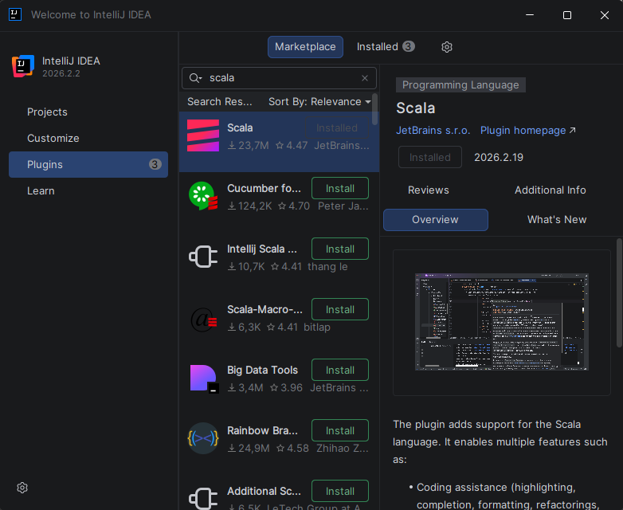
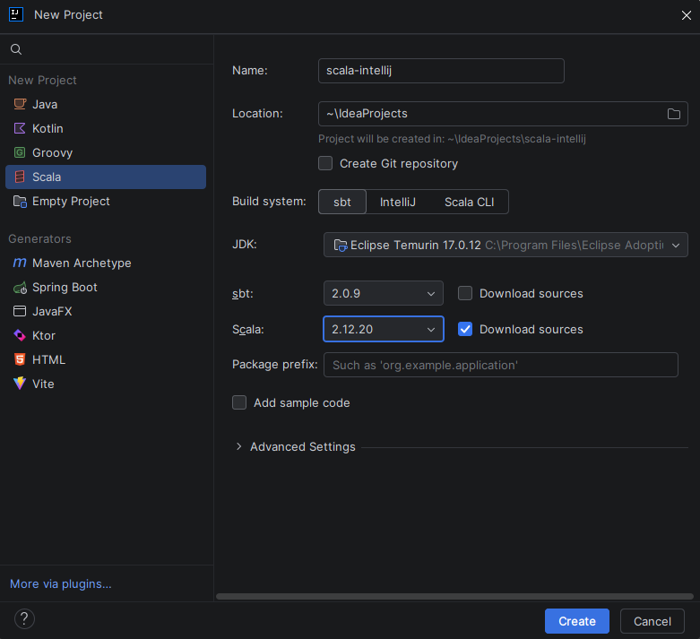
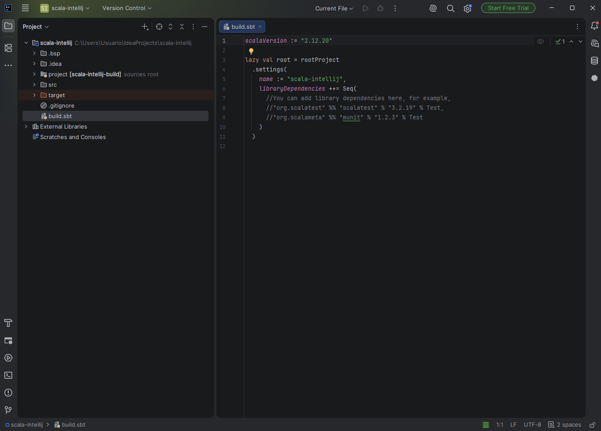
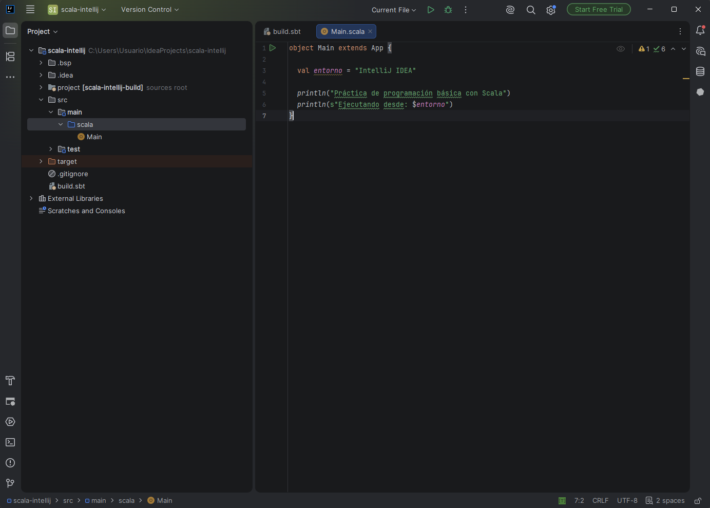
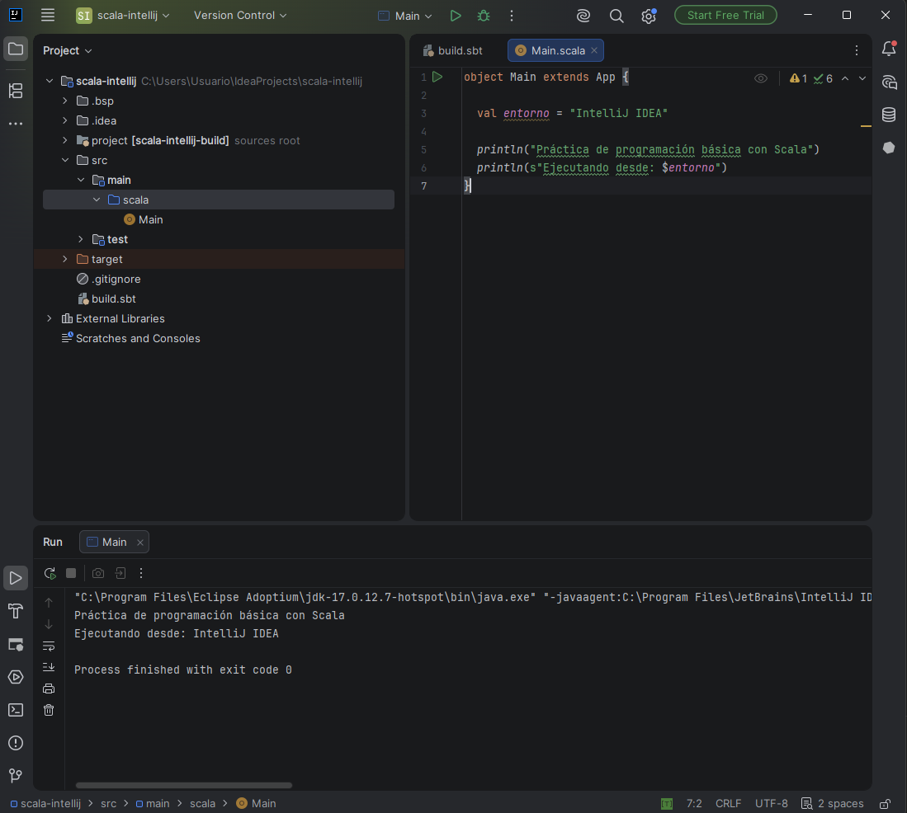
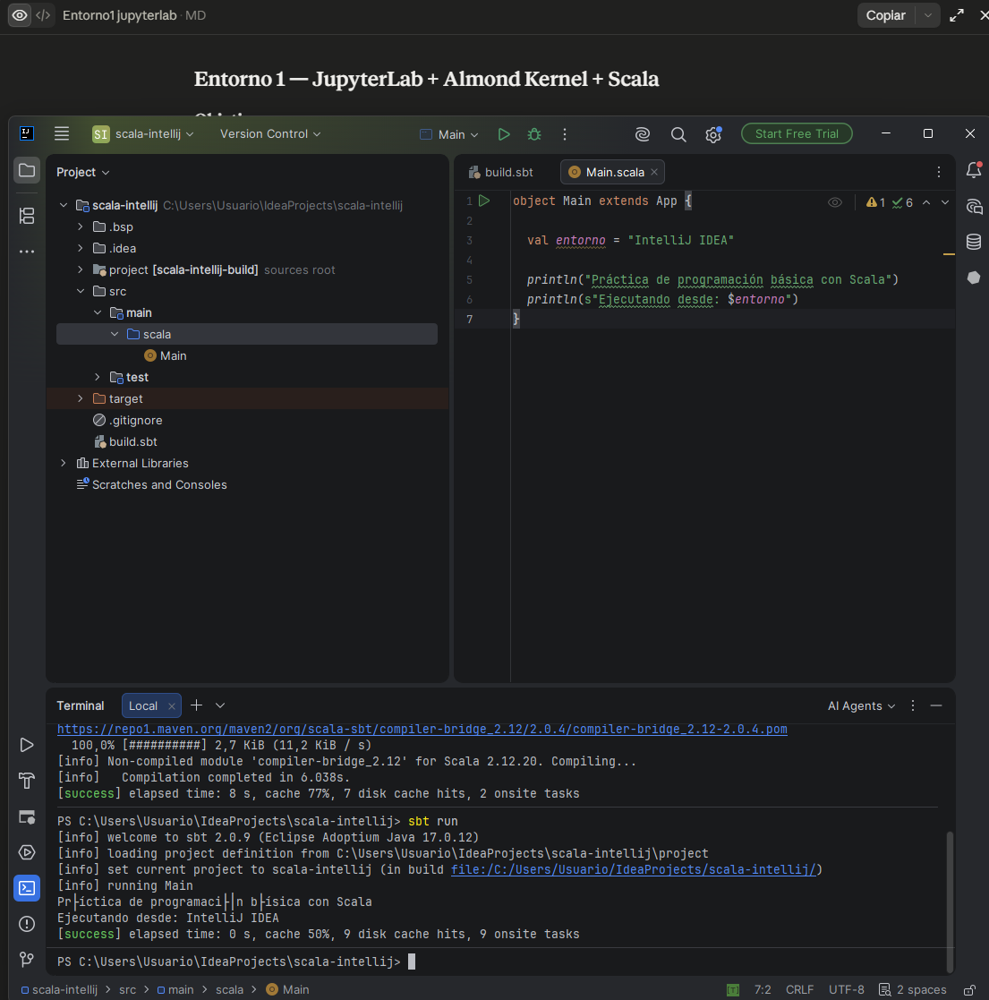

# Entorno 3 — IntelliJ IDEA Community + Scala 2.12.20 + sbt

## Objetivo

Preparar un segundo entorno de desarrollo basado en un IDE completo, usando IntelliJ IDEA Community Edition con el plugin de Scala y sbt como herramienta de construcción.

## 1. Instalación de IntelliJ IDEA Community Edition

Descargué IntelliJ IDEA Community Edition desde la web oficial de JetBrains y lo instalé con las opciones por defecto (creación de acceso directo en el escritorio).


*Pantalla de bienvenida de IntelliJ IDEA tras la instalación, con las opciones "New Project", "Open", etc.*

## 2. Instalación del soporte para Scala

Desde la sección de Plugins, busqué "Scala" e instalé el plugin oficial publicado por JetBrains. Tras instalarlo, reinicié el IDE como se solicitó.

En mi caso, tras la primera instalación el plugin no apareció activo en el asistente de nuevos proyectos; tuve que comprobar en la pestaña "Installed" de Plugins que estuviera correctamente habilitado antes de que apareciera la opción "Scala" al crear un proyecto nuevo.



*Pestaña de plugins instalados mostrando "Scala" habilitado.*

## 3. Configuración de JDK 17

Al crear el proyecto, seleccioné el JDK 17 (Eclipse Adoptium 17.0.12), que IntelliJ detectó automáticamente al tenerlo ya instalado en el sistema.

## 4. Creación del proyecto sbt

Creé un nuevo proyecto desde `File → New → Project`, seleccionando:

- Tipo de proyecto: **Scala**
- Build system: **sbt**
- Nombre: **scala-intellij**
- JDK: **Eclipse Adoptium 17.0.12**
- Versión de Scala: **2.12.20**



*Asistente de creación de proyecto mostrando el nombre, JDK 17 y Scala 2.12.20 seleccionados.*

**Nota sobre la versión de Scala**: igual que en los otros dos entornos, usé Scala 2.12.20 en lugar de la 2.12.21 solicitada en el enunciado, ya que esta última no está disponible en el ecosistema de herramientas usado (ver justificación detallada en la documentación del Entorno 1).

## 5. Revisión de build.sbt

IntelliJ generó automáticamente el archivo `build.sbt` con el siguiente contenido:

```scala
scalaVersion := "2.12.20"

lazy val root = rootProject
  .settings(
    name := "scala-intellij",
    libraryDependencies ++= Seq(
      // dependencias comentadas por defecto
    )
  )
```



*Contenido de build.sbt, usando la sintaxis moderna de sbt (`rootProject.settings`) que IntelliJ genera por defecto, equivalente a la sintaxis clásica usada en los otros dos entornos.*

## 6. Creación del programa Scala

Creé el archivo `src/main/scala/Main.scala` con el siguiente contenido:

```scala
object Main extends App {

  val entorno = "IntelliJ IDEA"

  println("Práctica de programación básica con Scala")
  println(s"Ejecutando desde: $entorno")
}
```



*Archivo Main.scala con el código del programa.*

## 7. Ejecución desde IntelliJ IDEA

Ejecuté el programa directamente desde el icono de "Run" junto a la declaración del objeto `Main`, usando las herramientas integradas del propio IDE.



*Consola integrada de IntelliJ mostrando la salida del programa y "Process finished with exit code 0".*

## 8. Ejecución mediante sbt

Desde la terminal integrada de IntelliJ, ejecuté:

```bash
sbt compile
```

y a continuación:

```bash
sbt run
```



*Salida de ambos comandos mostrando `[success]` en la compilación y la ejecución correcta del programa.*

## Evidencias incluidas

- [x] IntelliJ IDEA Community instalado
- [x] Plugin de Scala instalado
- [x] JDK 17 configurado
- [x] Proyecto sbt creado
- [x] Scala 2.12.20 configurado
- [x] Estructura del proyecto
- [x] Archivo `build.sbt`
- [x] Archivo `Main.scala`
- [x] Ejecución desde IntelliJ IDEA
- [x] Ejecución mediante `sbt run`
