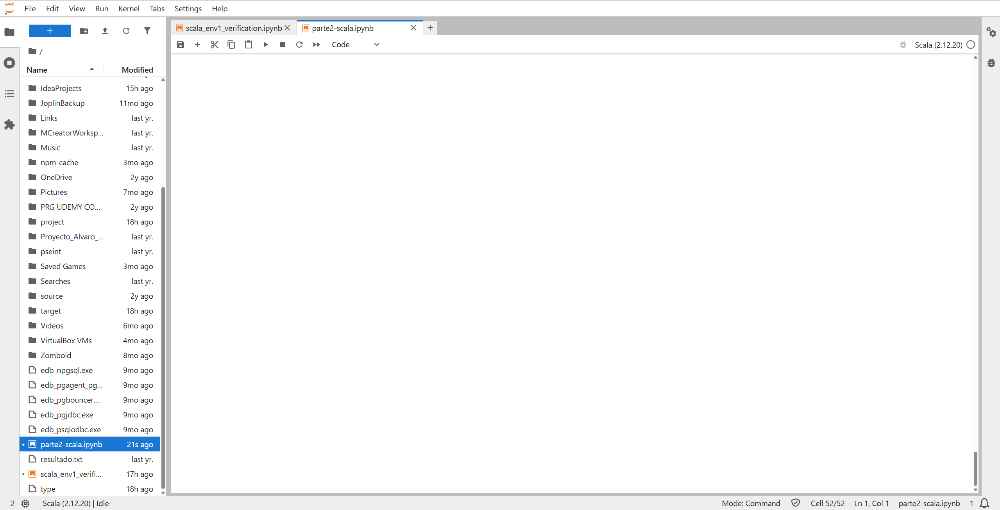
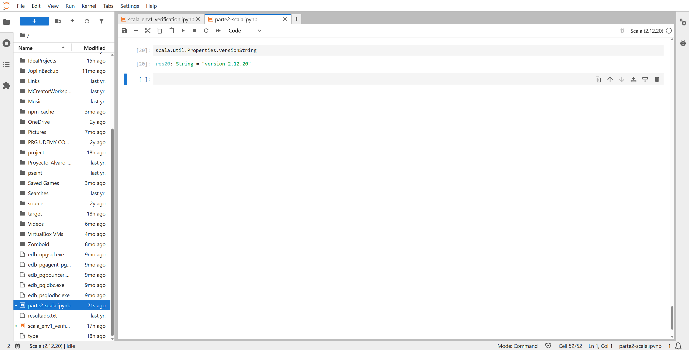
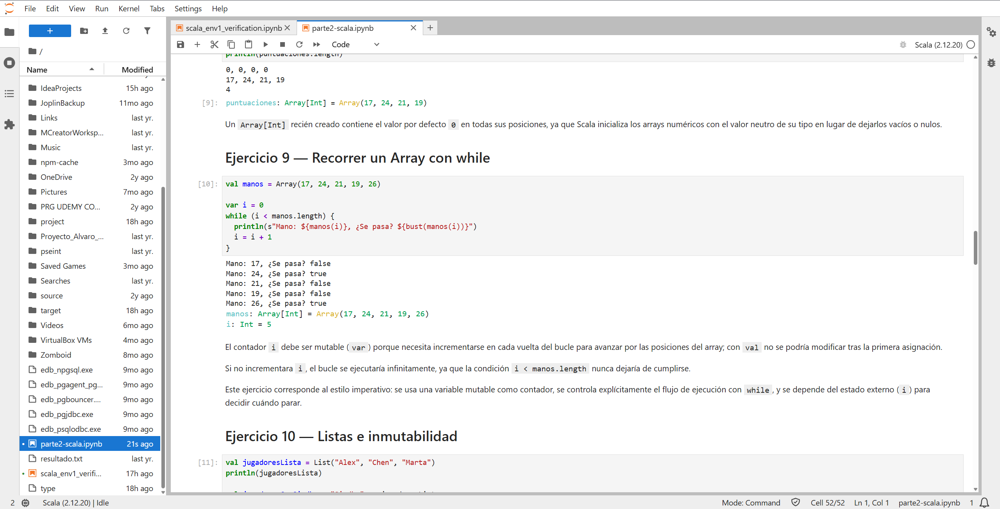
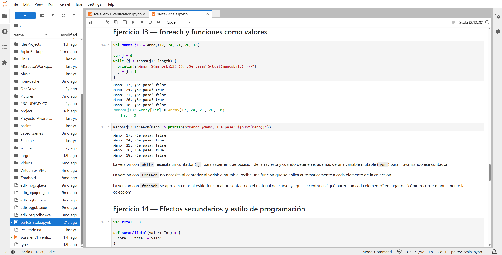
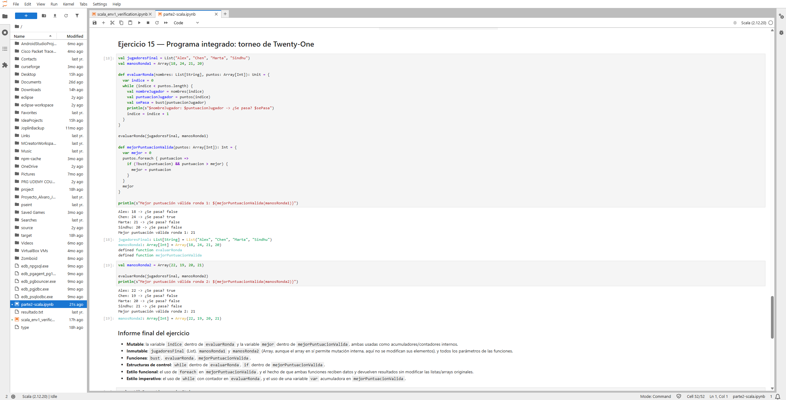

# Parte 2 — Programación con Scala

## Entorno utilizado

- JupyterLab
- Almond Kernel
- Scala 2.12.20

**Nota sobre la versión de Scala**: el enunciado pedía Scala 2.12.21, pero esa versión no tiene ningún kernel de Almond publicado en Maven Central (ver justificación detallada en la documentación de la Parte 1, Entorno 1). Se usó la versión 2.12.20 por consistencia con el resto de la práctica.

## Contenido

Esta parte contiene los 15 ejercicios de programación básica en Scala (variables, tipos, funciones, arrays, listas, estructuras de control, operadores, `while`, `foreach`, mutabilidad/inmutabilidad y estilos imperativo/funcional), realizados en un único notebook de Jupyter con el kernel Almond.

## Notebook

Ver [`parte2-scala.ipynb`](./parte2-scala.ipynb)

El notebook contiene, para cada uno de los 15 ejercicios: una celda Markdown con el título y la explicación de la solución, una o varias celdas de código Scala con la resolución, y las salidas de la ejecución. Los ejercicios que lo requerían (2 y 7) incluyen además la celda con el error de compilación intencionado, sin eliminar, como evidencia de la inmutabilidad de `val` y de la seguridad de tipos en `Array`.

## Evidencias

### JupyterLab con Almond

*Notebook `parte2-scala.ipynb` abierto en JupyterLab con el kernel "Scala (2.12.20)" seleccionado y en estado "Idle".*

### Versión de Scala utilizada

*Resultado de `scala.util.Properties.versionString`, confirmando la versión 2.12.20 usada en todo el notebook.*

### Ejercicio 9 — Recorrido de un Array con `while`

*Ejecución del bucle `while` que recorre el array `manos`, mostrando para cada posición el valor de la mano y si supera 21 puntos (`bust`).*

### Ejercicio 13 — `foreach` frente a `while`

*Comparación de las dos versiones del recorrido del array: la Versión A con `while` y contador manual, y la Versión B con `foreach`, ambas produciendo el mismo resultado con estilos distintos.*

### Ejercicio 15 — Torneo de Twenty-One completo

*Ejecución completa del programa integrado: evaluación de la ronda 1 y la ronda 2 de puntuaciones, con el detalle de qué jugadores se pasan de 21 y cuál es la mejor puntuación válida de cada ronda.*

## Conclusiones generales

A lo largo de los 15 ejercicios se ha trabajado tanto el estilo imperativo (bucles `while` con contadores mutables, variables `var` que acumulan estado) como el estilo funcional (`foreach`, funciones puras que reciben parámetros y devuelven resultados sin modificar el entorno). El ejercicio 15 combina ambos estilos en un mismo programa, mostrando cómo Scala permite alternar entre ellos según convenga.
