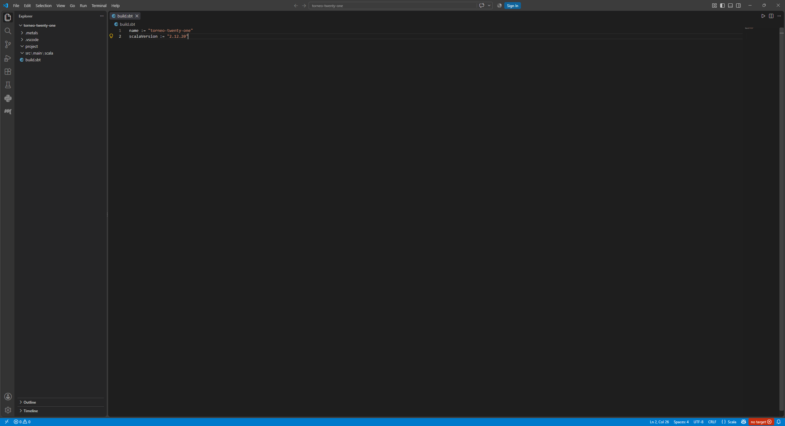
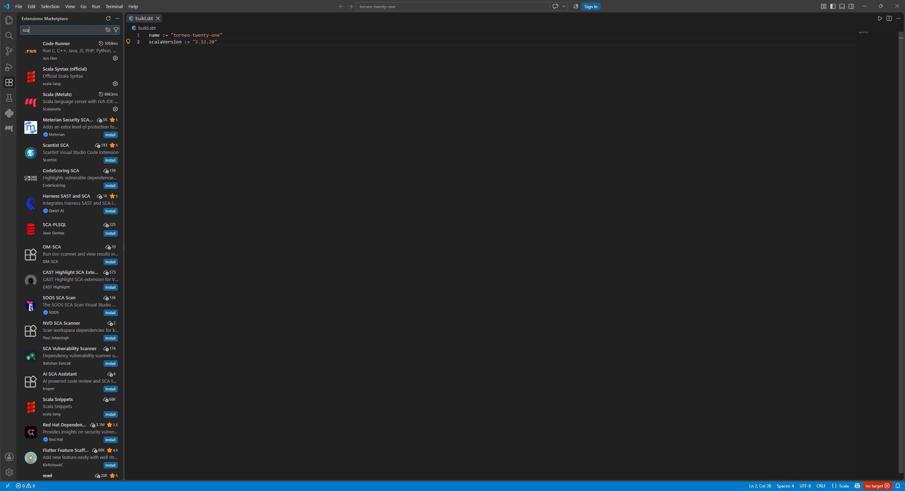
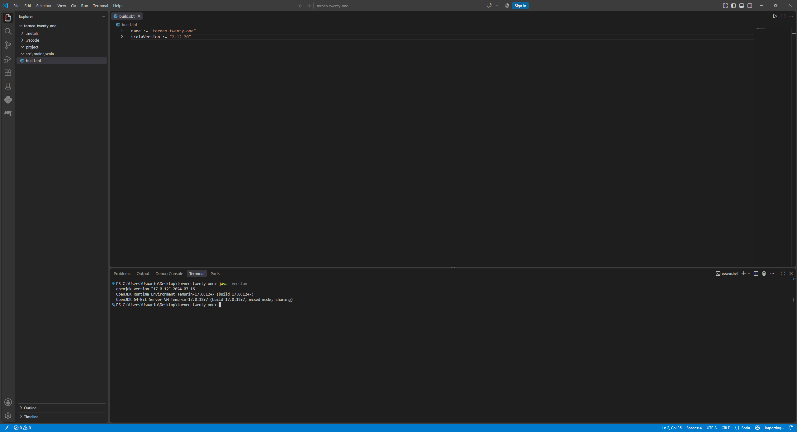
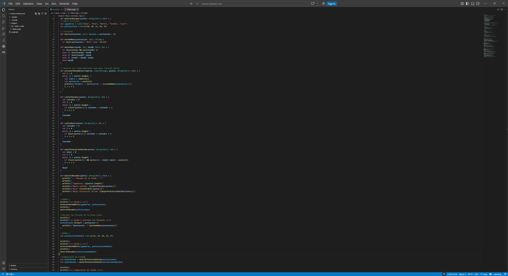
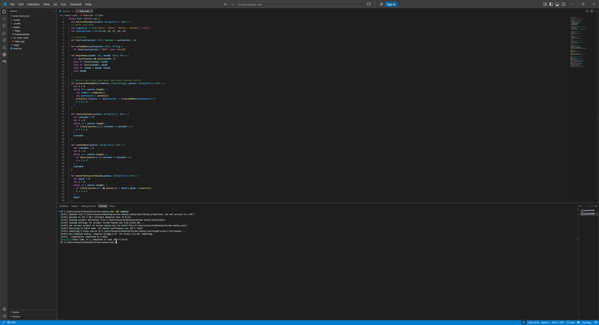
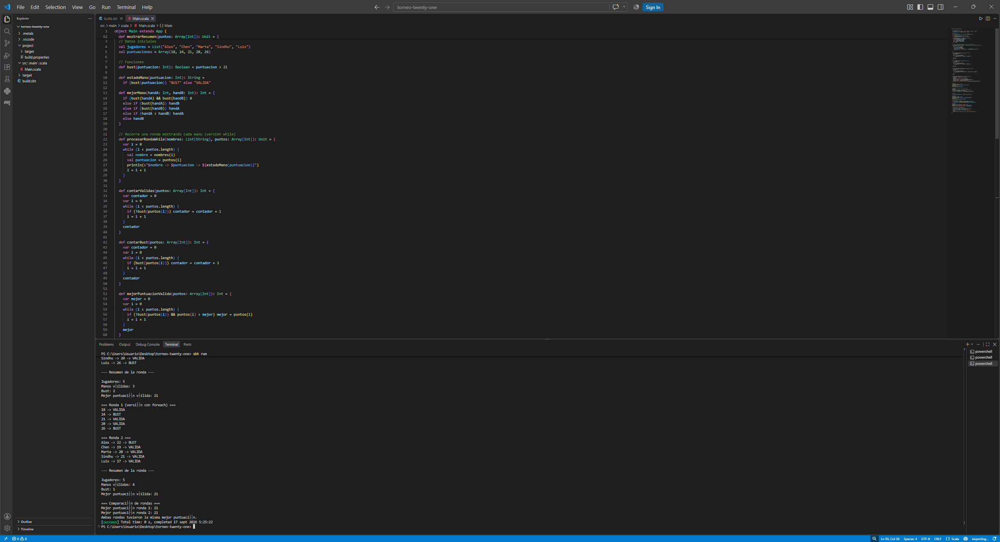

# Mini proyecto 3.1 — Torneo de Twenty-One

## Entorno

- Visual Studio Code
- Metals
- Scala 2.12.20
- JDK 17
- sbt

**Nota sobre la versión de Scala**: se usó 2.12.20 en lugar de 2.12.21 por la misma razón documentada en la Parte 1 (Almond, y por extensión el ecosistema usado en toda la práctica, no tiene soporte para esa versión exacta).

## Descripción

Programa que analiza los resultados de dos rondas de un torneo de Twenty-One. Para cada ronda determina si cada jugador se ha pasado de 21 (`bust`), cuántas manos son válidas, cuántas se han pasado, y cuál es la mejor puntuación válida. Al finalizar ambas rondas, compara los resultados entre sí.

## Estructura

```
torneo-twenty-one/
├── build.sbt
├── project/
└── src/
    └── main/
        └── scala/
            └── Main.scala
```

## Funciones utilizadas

- `bust(puntuacion: Int): Boolean` — determina si una puntuación supera 21.
- `estadoMano(puntuacion: Int): String` — devuelve "VALIDA" o "BUST" según la puntuación.
- `mejorMano(handA: Int, handB: Int): Int` — compara dos manos aplicando las reglas del enunciado.
- `procesarRondaWhile` — recorre jugadores y puntuaciones mostrando el estado de cada mano, usando `while`.
- `contarValidas`, `contarBust`, `mejorPuntuacionValida` — funciones auxiliares de estadísticas, todas implementadas con `while`.
- `mostrarResumen` — imprime el resumen de una ronda.

## Colecciones utilizadas

- `List[String]` para los nombres de los jugadores (inmutable, no se modifica en ningún momento).
- `Array[Int]` para las puntuaciones de cada ronda (se usan dos arrays independientes, uno por ronda, sin modificar ninguno tras su creación).

## Ejecución

```bash
sbt compile
sbt run
```

## Resultados

El programa procesa la ronda 1 (`Array(18, 24, 21, 20, 26)`) y la ronda 2 (`Array(22, 19, 20, 21, 17)`), mostrando para cada una el detalle jugador por jugador, el resumen de válidas/bust/mejor puntuación, y finalmente compara la mejor puntuación de ambas rondas, indicando cuál fue superior o si empataron. En las pruebas realizadas, ambas rondas obtuvieron la misma mejor puntuación válida (21).

## Comparación `while` vs `foreach`

Después de resolver la ronda 1 con `while` (función `procesarRondaWhile`), se incluyó una segunda versión del mismo recorrido usando `foreach` sobre el array de puntuaciones.

- La versión con **`while`** necesita un contador (`i`) declarado como `var` para saber en qué posición está y decidir cuándo detenerse.
- La versión con **`foreach`** no necesita contador ni variable mutable: la función se aplica automáticamente a cada elemento del array.
- La versión con **`foreach`** se aproxima más al estilo funcional presentado en el material del curso, ya que describe "qué hacer con cada elemento" sin gestionar manualmente el recorrido.

## Evidencias



*Proyecto sbt `torneo-twenty-one` abierto en Visual Studio Code, mostrando la estructura de carpetas a la izquierda.*



*Panel de extensiones mostrando "Scala (Metals)" instalada y activa.*



*Resultado de `java -version` desde la terminal integrada de VS Code, confirmando el JDK 17.*



*Archivo `Main.scala` con el programa completo.*



*Resultado de `sbt compile`, confirmando compilación correcta.*



*Resultado de `sbt run`, mostrando la ejecución completa: ronda 1, versión con foreach, ronda 2 y comparación final.*

## Problemas encontrados y solución

Durante la configuración del entorno, Metals no detectaba el proyecto (`No build targets were detected`) porque Visual Studio Code se había abierto antes de corregir la variable de entorno `JAVA_HOME`, que apuntaba a una instalación de Java 21 ya eliminada del sistema. Además, al ejecutar `java -version` desde la terminal integrada de VS Code, seguía apareciendo el JDK 21 en vez del 17, aunque en una terminal externa (cmd) sí aparecía el 17 correctamente. La causa fue la misma en ambos casos: VS Code hereda las variables de entorno del momento en que se abre, así que cualquier cambio posterior en el `PATH` o `JAVA_HOME` del sistema no se aplica hasta cerrar el programa por completo y volver a abrirlo. Cerrando y reabriendo VS Code, tanto Metals como la terminal integrada pasaron a usar el JDK 17 correctamente.
