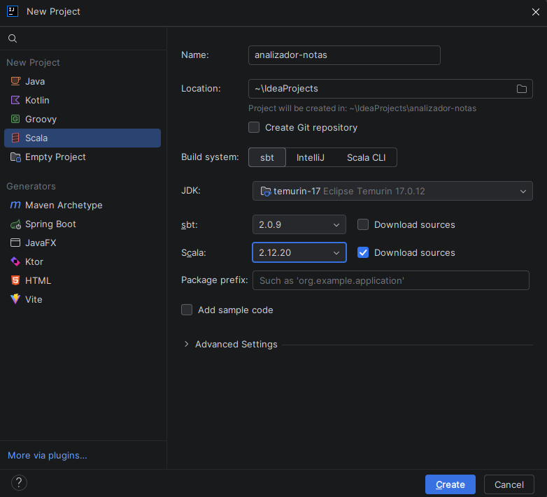
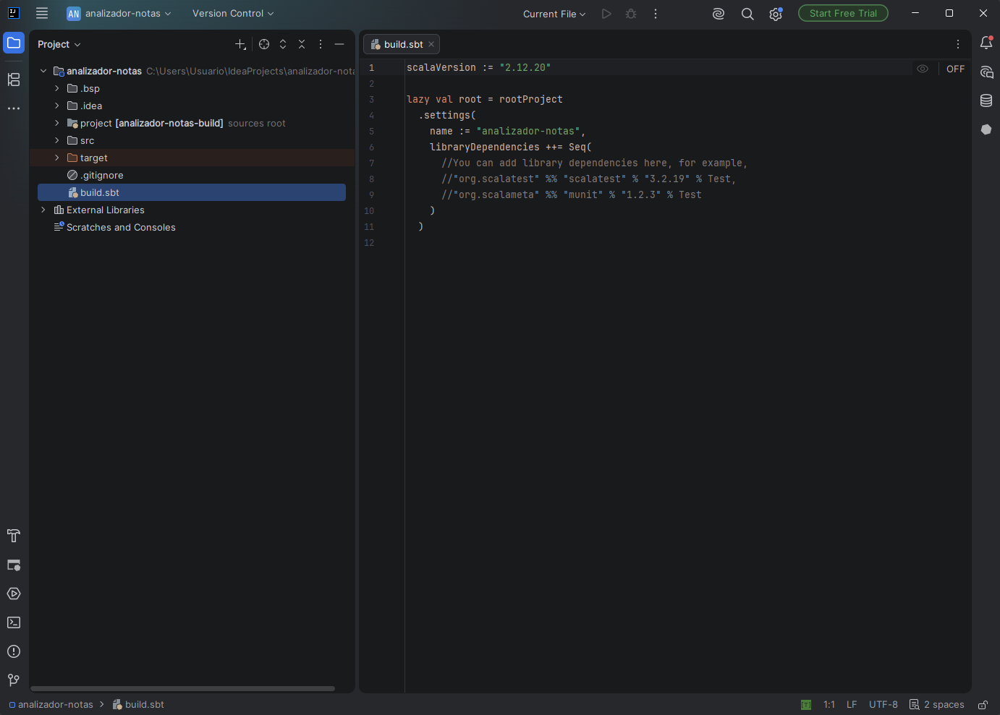
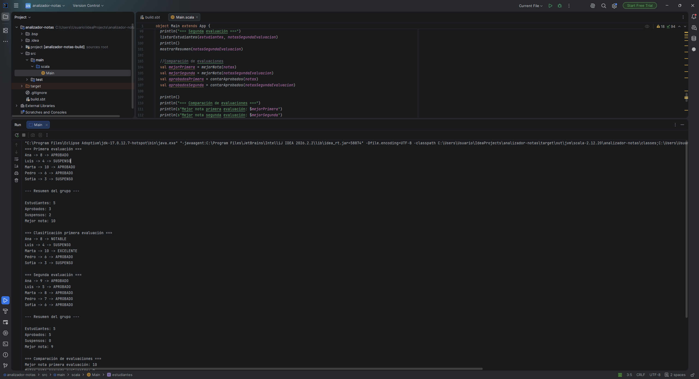
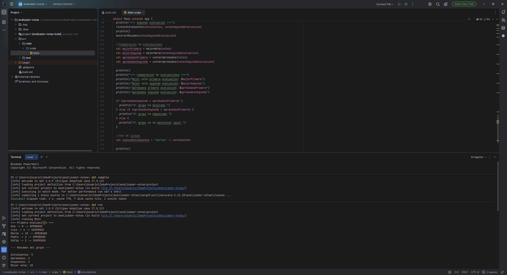

# Mini proyecto 3.2 — Analizador de calificaciones de un grupo

## Entorno

- IntelliJ IDEA Community
- Scala 2.12.20
- JDK 17
- sbt

**Nota sobre la versión de Scala**: se usó 2.12.20 en lugar de 2.12.21, siguiendo el mismo criterio aplicado en toda la práctica (ver justificación en la Parte 1).

## Descripción

Aplicación que analiza las calificaciones de un grupo de estudiantes en dos evaluaciones distintas. Determina quién aprueba y quién suspende, calcula estadísticas del grupo (aprobados, suspensos, mejor nota), clasifica cada nota en un rango (excelente, notable, aprobado, suspenso), y compara los resultados de ambas evaluaciones para indicar si el grupo ha mejorado, empeorado o se ha mantenido igual.

## Estructura

```
analizador-notas/
├── build.sbt
├── project/
└── src/
    └── main/
        └── scala/
            └── Main.scala
```

## Funciones utilizadas

- `aprobado(nota: Int): Boolean` — determina si una nota es igual o superior a 5.
- `estadoNota(nota: Int): String` — devuelve "APROBADO" o "SUSPENSO".
- `maxNota(a: Int, b: Int): Int` — devuelve la mayor de dos notas.
- `clasificacion(nota: Int): String` — clasifica una nota en EXCELENTE / NOTABLE / APROBADO / SUSPENSO según su rango.
- `listarEstudiantes`, `listarClasificacion` — recorren estudiantes y notas mostrando su estado, usando `while`.
- `contarAprobados`, `contarSuspensos`, `mejorNota` — funciones auxiliares de estadísticas, todas con `while`.
- `mostrarResumen` — imprime el resumen del grupo.

## Colecciones utilizadas

- `List[String]` para los nombres de los estudiantes (inmutable).
- `Array[Int]` para las notas, con dos arrays independientes (uno por evaluación).
- Se creó además una nueva lista (`nuevosEstudiantes`) añadiendo un estudiante al principio mediante el operador `::`, sin modificar la lista original `estudiantes` en ningún momento — Scala construye una lista nueva reutilizando los elementos de la original, dado que `List` es una estructura inmutable.

## Ejecución

```bash
sbt compile
sbt run
```

También se ejecutó directamente desde el propio IDE usando el botón de "Run" junto a la declaración de `Main`.

## Resultados

Con la primera evaluación (`Array(8, 4, 10, 6, 3)`) el grupo obtuvo 3 aprobados y 2 suspensos, con la mejor nota siendo un 10. Con la segunda evaluación (`Array(9, 5, 8, 7, 6)`) todos los estudiantes aprobaron (5 de 5), aunque la mejor nota individual bajó a un 9. Comparando ambas evaluaciones por número de aprobados, el programa concluye correctamente que **el grupo ha mejorado**.

## Evidencias



*Asistente de creación de proyecto en IntelliJ IDEA, mostrando el nombre `analizador-notas`, JDK 17 y Scala 2.12.20 seleccionados.*



*Contenido de `build.sbt`, con el nombre del proyecto y la versión de Scala configurados.*



*Consola integrada de IntelliJ mostrando la salida completa del programa tras ejecutarlo con el botón "Run", incluyendo ambas evaluaciones, la comparación y la lista de estudiantes.*



*Resultado de `sbt compile` y `sbt run` ejecutados desde la terminal integrada de IntelliJ.*

## Problemas encontrados y solución

El plugin de Scala, aunque se había instalado, no aparecía como opción disponible al crear un nuevo proyecto la primera vez. Se solucionó comprobando en la pestaña "Installed" de Plugins que el plugin estuviera realmente habilitado (no solo instalado) y reiniciando el IDE; tras esto, "Scala" apareció correctamente en el asistente de nuevos proyectos. También hubo que prestar atención al desplegable de versión de Scala del asistente, que por defecto proponía una versión de Scala 3 en lugar de 2.12.x.
